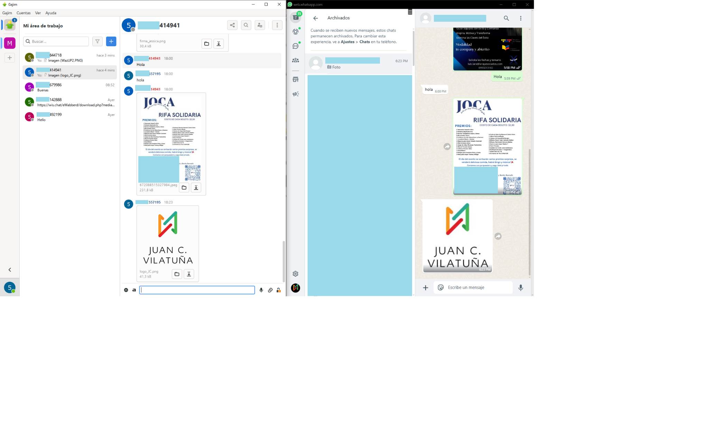

# eWabber - WhatsApp ↔ Ejabberd Gateway

Author: Juan Carlos Vilatuña
Contact: juancarlosvila@gmail.com
License: MIT

---

## Project Structure

```
/eWabber
│
├── src/
│   ├── webhook.php
│   ├── router.php
│   └── download.php
│
├── assets/
│   └── eWabber.png
│
├── README.md
├── LICENSE
└── .gitignore
```

---

## Features

- Receive WhatsApp messages via webhook
- Forward WhatsApp messages to Ejabberd XMPP clients
- Forward XMPP messages to WhatsApp
- Support for multimedia (image, audio, video, documents)
- Auto-create virtual contacts in Ejabberd
- XMPP messages with OOB (Out-of-Band) links compatible with Gajim

---

## ejabberd Required Modules

Make sure you have the following modules enabled in `ejabberd.yml`:

```yaml
modules:
  mod_http_upload:
    docroot: "/var/www/ejabberd/upload"
    put_url: https://your-server/upload
    max_size: 10485760

  mod_rest:
    allowed_ips: ["127.0.0.1"]
```

---

## Installation Steps

1. Clone the repository

```bash
git clone https://github.com/your-user/eWabber.git
cd eWabber
```

2. Setup PHP dependencies (optional if you extend it)

```bash
composer install
```

3. Configure ejabberd REST API and HTTP Upload properly
4. Copy files to your PHP server's public directory
5. Edit `src/webhook.php`, `src/router.php` and `src/download.php` with your credentials

---

## Configuration Files

- `src/webhook.php`: Receives WhatsApp messages and forwards to Ejabberd
- `src/router.php`: Forwards XMPP messages to WhatsApp
- `src/download.php`: Proxy to download WhatsApp media securely

---

## Example Usage

Once properly installed, messages from WhatsApp will reach XMPP clients with images or documents using the OOB standard.



---

## Credits

Developed by Juan Carlos Vilatuña
Email: juancarlosvila@gmail.com

MIT License
